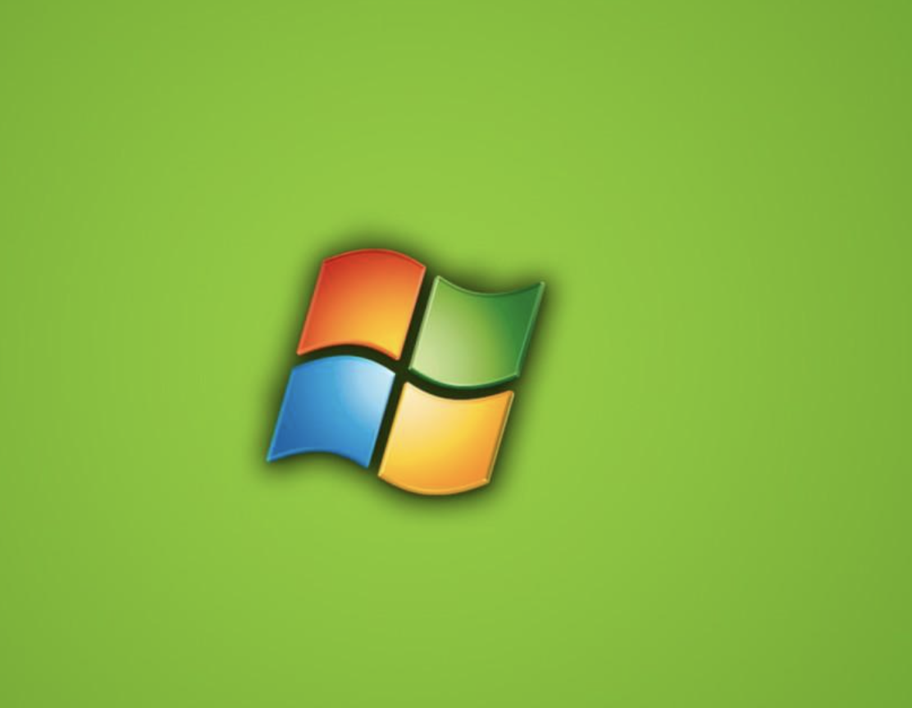
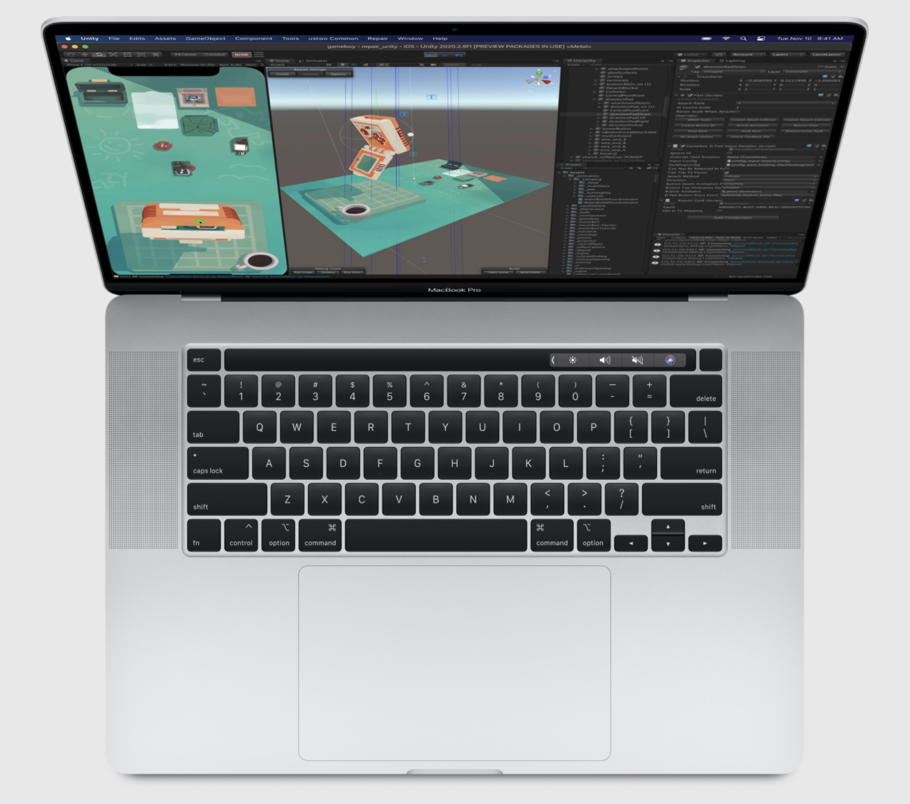
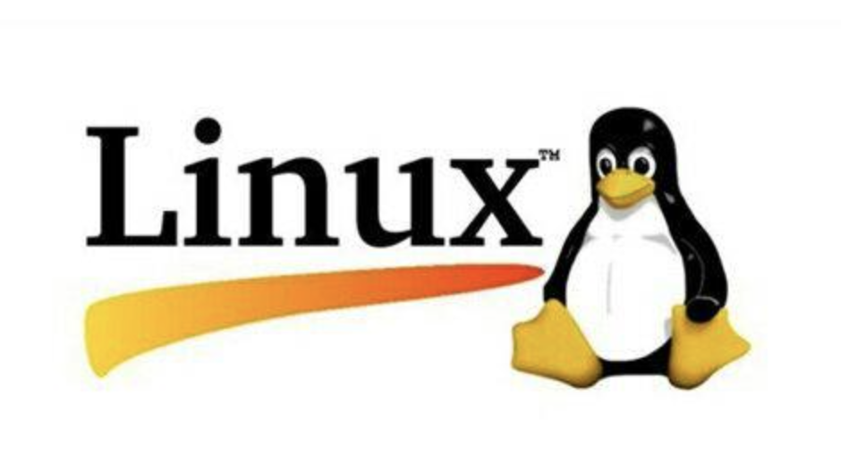

# 环境安装

##  欲为大树，莫与草争

 这一篇的标题，是一个故事,也是给很多正在学习的朋友一个提醒。

####  刚开始入门的你，别把学习精力卡在了环境问题上被难倒。很多朋友，在学习过程中看了一些不适合的书，告诉你要安装xxx，绕了一大圈最后选择了放弃。

在开始学习前，要把 **问题和关键放在如何学习写代码和如何写好代码上面**。

关于环境的问题，`能运行你现在写的代码就行`了。

## 关于环境选择

我们准备了三个环境版本，应对不同的开发者。其实除了我们平时所用的Windows系统对应的个人电脑外。我建议，你自己经常用什么电脑就选择什么系统，**熟悉就好**。不用单独为了学Python准备自己不熟悉的系统和电脑。

微软公司开发的Windows系统：

还有苹果电脑的系统Mac OS X；

此外，还有在服务器上经常使用的操作系统：Linux操作系统。

