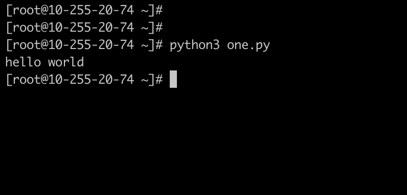
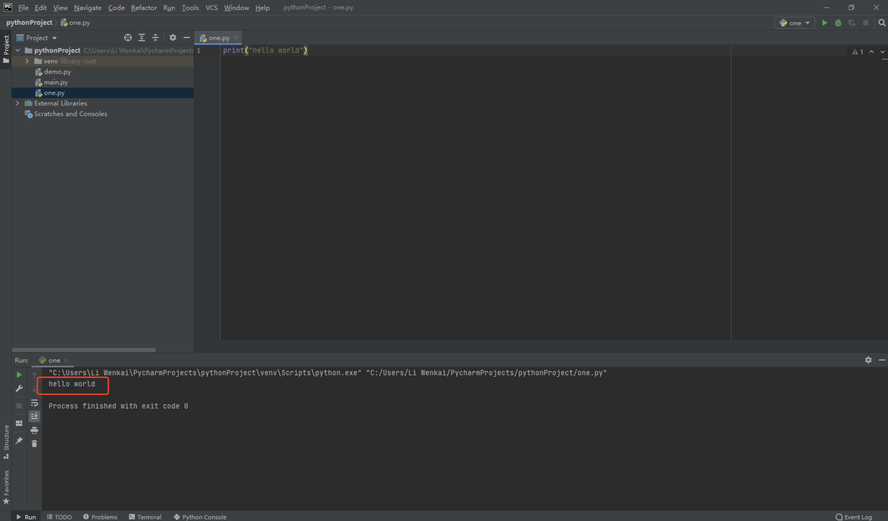
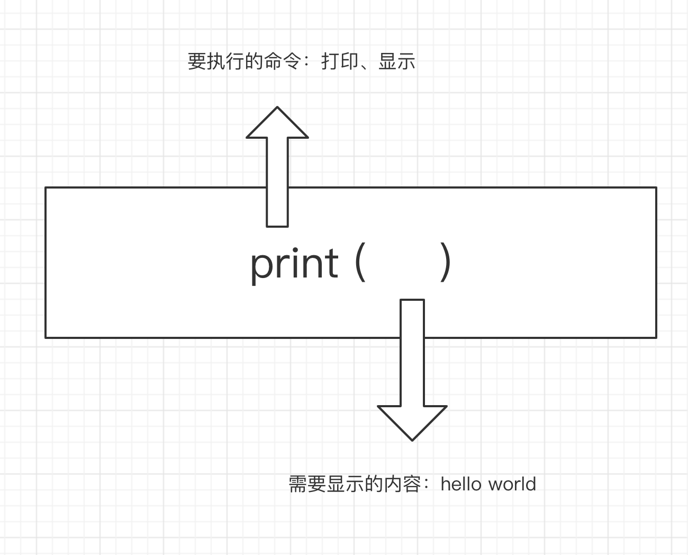

# 第一行python代码

## 1. 新建文件

在你的项目下或者自己指定的目录下，新建一个文件，文件名为：one.py。

在文件中写入如下内容：

~~~
print("hello world")
~~~

> 注：你可以尝试将引号内的内容改为其他内容试一下。

## 2. 运行代码

>  请按本书目录中的：[准备开始写代码之前](part1/start.md)   中的方式运行代码。

运行结果如下，在开发工具里，或者是命令行里面显示出来了：

~~~
hello world
~~~

命令行运行结果如下：

开发工具运行结果如下：

## 3. Python函数解释

## 4. 代码解释说明

print 是指Python语言里面的显示、输出、打印的一个功能（语法）。

双引号的主要功能是：将要显示的文字用双引号包起来。

hello world 就是我想要显示出来的一句话。你可以显示任何一句话，显示 :beijing Beijing也是可以的。

将双引号里面的内容改为其他内容，你试试？

## 5. 如果要写中文

~~~python
#coding=utf-8

print('你好，世界！')
~~~

有问题可以关注李文凯的博客提问。李老师会向你解答相关问题的哟~~~

****

注意事项：

* Python的代码部分全部要用英文输入法，**不要用中文输入法写代码**；
* 我们在写文件abc.py这个文件命名的时候，只用英文（a-zA-Z0-9_-）这些字符来命名文件；
* 文件命名不要用中文，不要用特殊符号，不要中间加空格；
* 文件名严格区分大小。