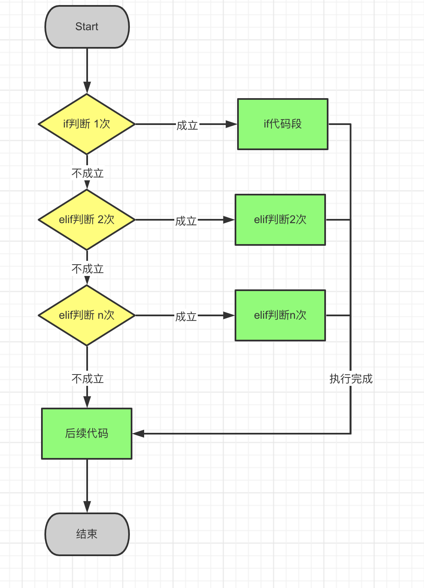

# if... elif... else


【知识点要求：默写】


还记得本章开篇我们讲了一个王思总同学的例子吗？

> 王同学是生活极度充满娱乐的人。他抵达北京或者大连的时候都要做一些事情，如下：

> 半夜到达，先去夜店参加假面舞会
> 早上抵达，爱在酒店泡个澡
> 中午到达，会吃上一份神户牛肉
> 晚上到达，总爱去找朋友去述说一下心中的寂寞

我们来了解一下其中的语法规则：

```
if 判断语句1:
			执行语句体1
elif 判断语句2:
			执行语句体2
elif 判断语句n:
  		执行语句体n
else:
      最后的else语句可选

#后续代码

```

> el if  是 else if的简写，在Python里写为——elif。
>
> else  其他的、否则
>
> if	  如果

上述结构表示：
如果判断语句1的值为真，则执行语句体 1。执行完成后进入后续代码段。
否则转入后面的判断语句2（elif），判断语句2若为真，则执行语句体 2。
否则转入后面的判断语句n（elif），判断语句2若为真，则执行语句体 n。
如果均不匹配则执行else语句。这种循环嵌套可以不含else语句，即只含有if、elif语句。


我们把上面的代码用流程图的形式表示清楚就如下图了：




我们可以把王思总同学的例子通过Python代码表示出来，代码表示结果如下：

```python
#coding=utf-8

#加载一个随机数的库
import random

#定义一个随机变量，抵达时间,随机0点至23点
dida = random.randint(0, 23)

print(dida)

if  dida > 6 and dida < 10 :
    print('我爱泡澡')
elif dida >10 and dida < 14:
    print('吃神户牛肉')
elif dida >= 19 and dida < 22:
    print('找一个朋友聊聊内心的寂寞')
elif  dida > 22 and dida <= 23:
    print('泡澡')
elif  dida >= 1 and dida <3:
    print('泡澡')
else:
     print('睡觉或者工作')

```

你可以尝试一下运行结果，我们实现了我们开始讲的故事。

每一次运行的结果可能都不同，我们看一下运行某一次的结果：

~~~
9					
我爱泡澡	
~~~


注意：

> random ：是一个随机数的库，是系统默认的一个功能库。
>
> randint(开始值，结束值)：随机产生 开始值  至 结束值的整数。
>
> import 是加载random这个随机数的功能库。


****


作业：
写一个计算器提交分数段。分数段不同，显示的结果也不同，要求如下：

1. 0----60以下，不及格
2. 60---70及格了，要努力
3. 70---80 还不错
4. 80---90 上清华有希望
5. 90---100 你这辈子没希望了
6. 100 更没希望了
7. 100分以上 爱因斯坦转世啊，思密达！
8. 不是一个数值类型或者小于0 请输入正确的分数，提示：你输入错误。

