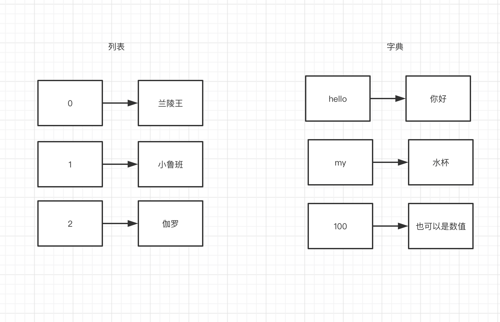
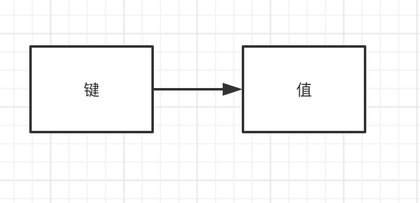

# 字典


## 1. 字典的特点

字典英文全称dictionary,我们通常会简称为Dict，不用理解字面意思，重点知道字典的特点。

列表在使用过程中存在一些不方便的问题：

1. 不方便追加；
2. 必须要是连续的整数下标标识；

如果下标要是文字呢？

比如：

> "hello" -> 你好
>
> hello 作为下标，你好  作为值。

通过之前对于列表和元组的学习，我们知道列表和元组都做不到。如果能用文字作为下标就方便多了，而字典恰恰是解决这个问题的。

我们用图对比一下列表和字典的不同：



字典通常是由键（下标、key）值 成对组成的。

如下图这样理解字典的组成：




## 2. 字典的声明

在Python里面创建字段的语法格式是这样规定的：

> {键名1 : 值1 , 键名2 : 值2 , 键名n : 值n }

字典的获取 值方式：

> 变量名[ 键名 ]


~~~python
my_dic = {
         '美' : '凤姐',
         '很美' : '芙蓉姐姐',
         'verymei' : '杨幂',
         '心中滴女神呀' : '华妃',
         100 : '孙俪'
}

print(my_dic)

print(my_dic["verymei"])       #字符串用单引号双引号都可以
print(my_dic[100])
~~~

我们运行一下看看输出结果：

~~~
{'美': '凤姐', '很美': '芙蓉姐姐', 'verymei': '杨幂', '心中滴女神呀': '华妃', 100: '孙俪'}
杨幂
孙俪
~~~

说明： 第一次运行显示出来了整个字典。第二次打印出来了键（也被称为：key、下标）为verymei的值。第三次打印出来了键为100的值。


## 3. 字典的改值

字典的修改值 和 追加值的方式：

> 变量名[ 键名 ] = 值

这个很简单，与变量赋值、改值很像。不过不同的是，多了一个键（下标、key）。

我们做个实验看一下结果：

~~~python
my_dic = {
         '美' : '凤姐',
         '很美' : '芙蓉姐姐',
         'verymei' : '杨幂',
         '心中滴女神呀' : '华妃',
         100 : '孙俪'
}

print(my_dic)

my_dic['很美'] = '小鲁班'

print(my_dic)
~~~

看一下运行结果：

~~~
{'美': '凤姐', '很美': '芙蓉姐姐', 'verymei': '杨幂', '心中滴女神呀': '华妃', 100: '孙俪'}
{'美': '凤姐', '很美': '小鲁班', 'verymei': '杨幂', '心中滴女神呀': '华妃', 100: '孙俪'}

~~~

可以看出如下结论：

下标为“很美”的值从第一次运行的  ：芙蓉姐姐  

变为了第二次运行的：小鲁班。


## 4. 字典追加元素

字典 追加元素的方式与改值很像：

> 变量名[ 键名 ] = 值
>
> 在字典变量后面写上一个不存在的键 ，并对这个键 赋值即为追加字典元素。


~~~python
my_dic = {
         '美' : '凤姐',
         '很美' : '芙蓉姐姐',
         'verymei' : '杨幂',
         '心中滴女神呀' : '华妃',
         100 : '孙俪'
}
print(my_dic)

my_dic['hello'] = '兰陵王'

print(my_dic)

~~~

看一下运行输出结果：

~~~
{'美': '凤姐', '很美': '芙蓉姐姐', 'verymei': '杨幂', '心中滴女神呀': '华妃', 100: '孙俪'}
{'美': '凤姐', '很美': '芙蓉姐姐', 'verymei': '杨幂', '心中滴女神呀': '华妃', 100: '孙俪', 'hello': '兰陵王'}
~~~


## 5. 使用get( ) 函数读取值


学习级别：了解

看你自己的使用习惯，如果你习惯使用上面的取值方式，也可以不用学习下面这种取值方式。


使用的语法格式：

> 字典变量名.get( 键名 )


```python
my_dic = {
         '美' : '凤姐',
         '很美' : '芙蓉姐姐',
         'verymei' : '杨幂',
         '心中滴女神呀' : '华妃',
         100 : '孙俪'
}

print(my_dic.get("心中滴女神呀"))
```


## 6. 使用keys()  或者values() 取出所有的键或者值

学习级别：掌握

在未来写代码的时候，我们需要一次性所有的键（下标、key）。那就可以使用keys() 一次性取出来。

用法如下：

> 字典变量.keys( )

在未来写代码的时候，我们需要一次性所有的值。那就可以使用values() 一次性取出来。

用法如下：

> 字典变量.values( )


我们做个实验看一下：

~~~python
my_dic = {
         '美' : '凤姐',
         '很美' : '芙蓉姐姐',
         'verymei' : '杨幂',
         '心中滴女神呀' : '华妃',
         100 : '孙俪'
}

print(my_dic.keys())
print(my_dic.values())


~~~


我们看一下运行结果：

~~~
dict_keys(['美', '很美', 'verymei', '心中滴女神呀', 100])
dict_values(['凤姐', '芙蓉姐姐', '杨幂', '华妃', '孙俪'])
~~~

以列表的方式取出了所有的键（下标、key） 和 值。


****

注意：

字典的 键 （key、下标）  为标准数据类型：整型 、字符串、浮点、布尔

更多用法，可以参考 [交互模式](cal.md) 中的 `help(dict) ` 查询相关字典的更多用法。

 


