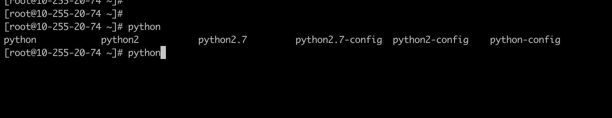
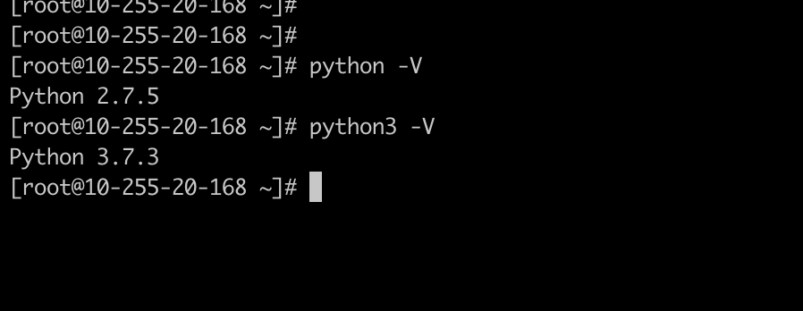
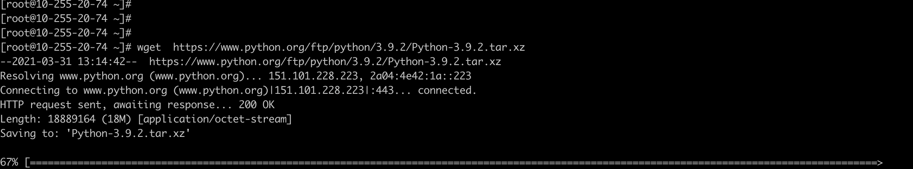
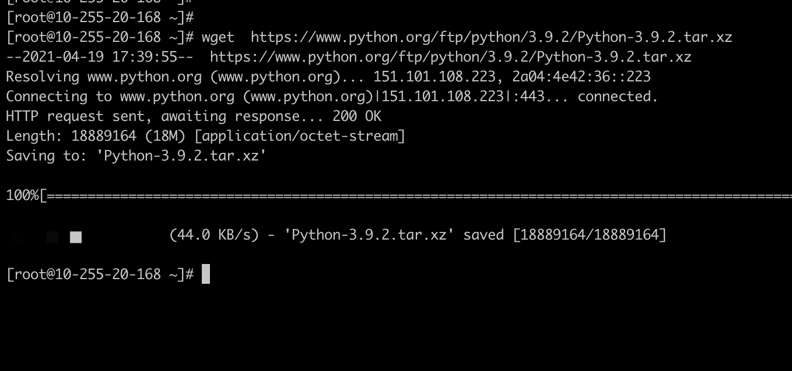
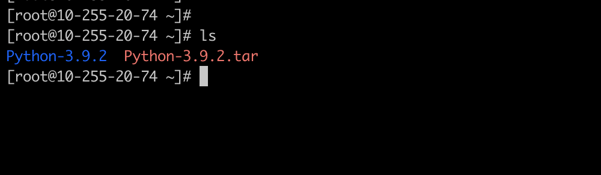
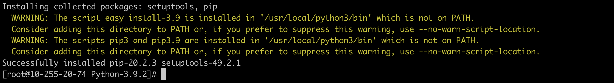
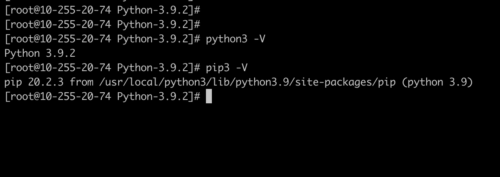

# Linux系统安装


Linux系列的系统，系统一般默认都安装了Python2.x。  这里建议安装Python3，以Python3 作为我们的基本学习和运行环境。

>Python 2的报废（EOL）：自2020年1月1日起，Python 2将不再得到支持。Python的核心开发人员将不再提供错误修复版或安全更新。因此，如果你仍在使用Python 2.x，是时候将代码移植到Python 3了。如果你继续使用未得到支持的模块，可能危及贵企业及数据的安全性，因为无人修复，漏洞迟早会出现。


## 检查已有环境

1.  进入Linux Shell环境；
2. 输入python，然后连接按两次tab键；
3. 即可显示当前已安装所有的Python版本（图一）；
4. 输入 python -V 即显示当前的Python 的主版本（图二）。




（图一）




（图二）


## Linux 安装Python


> 本次安装采用Redhat系列的CentOS7.x 作为演示安装环境。


1. 安装Python依赖

~~~
yum install openssl-devel bzip2-devel expat-devel gdbm-devel readline-devel sqlite-devel
~~~


2. 下载Python3.x安装包

~~~
wget  https://www.python.org/ftp/python/3.9.2/Python-3.9.2.tar.xz
~~~

> 更方Python3.x 版本请访问：https://www.python.org/downloads/source/



3. 下载成功




4. 解压xz

~~~
 xz -d Python-3.9.2.tar.xz
 
~~~

5. 解压 tar文件

~~~
 tar -xvf Python-3.9.2.tar
~~~



6. 进入目录

   ~~~
    cd Python-3.9.2
   ~~~

   

7. 创建目录

~~~
mkdir /usr/local/python3
~~~

8. 指定Python3.x 的安装目录并执行安装命令

```shell
./configure -prefix=/usr/local/python3

sudo make && make install
```

如果出现如下界面，即安装成功：




9. 设置软链接

```shell
ln -s /usr/local/python3/bin/python3 /usr/bin/python3 #为python3创建软连接
ln -s /usr/local/python3/bin/pip3 /usr/bin/pip3  #为pip3创建软连接
```

10. 验证是否安装成功

```shell
python3  -V   # 验证python3是否安装成功，以及确认版本号。
pip3 -V  			#	验证pip3安装是否成功和版本号。
```




