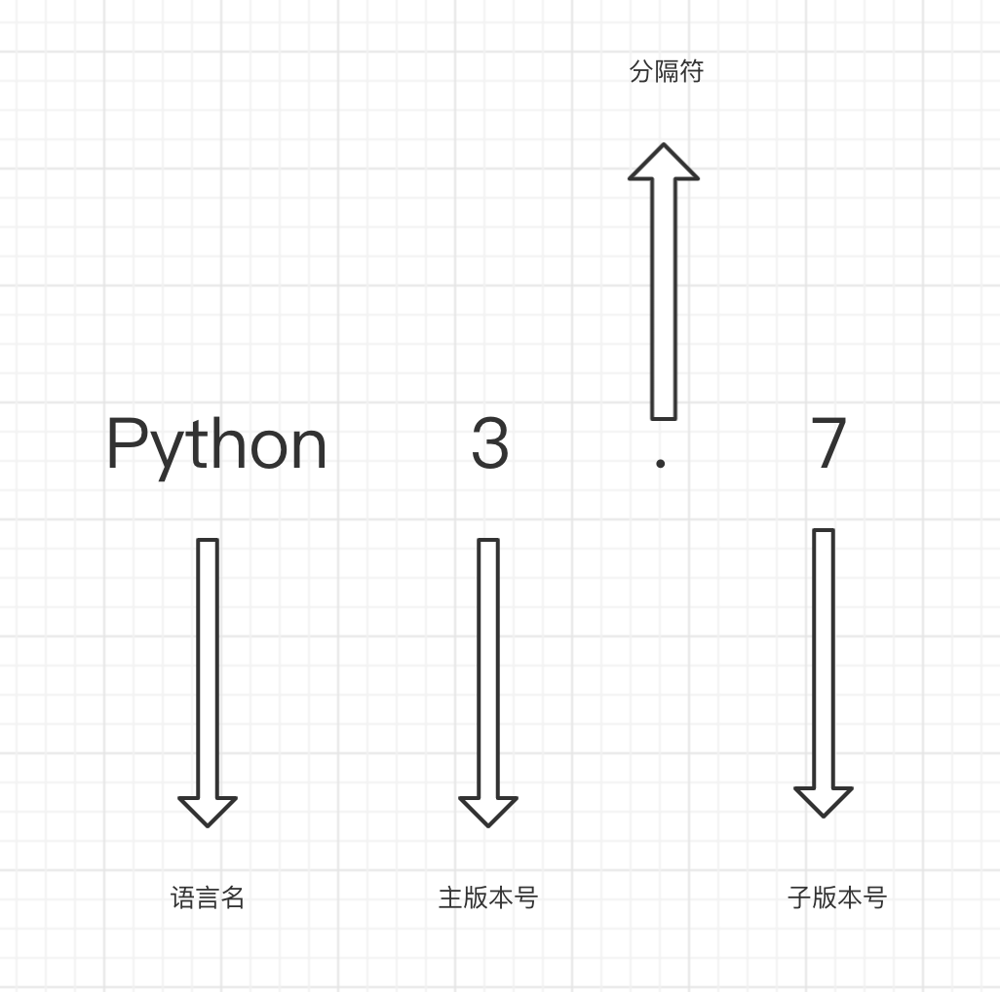

# 版本选择

请不要再使用Python2.x版本。官方公告如下：

> Python 2的报废（EOL），自2020年1月1日起，Python 2将不再得到支持。Python的核心开发人员将不再提供错误修复版或安全更新。因此，如果你仍在使用Python 2.x，是时候将代码移植到Python 3了。如果你继续使用未得到支持的模块，可能危及贵企业及数据的安全性，因为无人修复的漏洞迟早会出现。

Python的版本有很多，就像有win7、win10各种不同的版本，Python的版本有：

Python2.6

Python 2.7

Python3.6

Python3.7

**Python 3.7**  是由：Python（语言名）、 3 (主版本号)、  . （点）主版本与子版本分隔符、   7（子版本号）

大家在使用版本的时候使用3开始的Python版本就好。如：Python3.7, Python3.8 都可以。

以后关于3相关的版本，我们会简称为：3.x 。

 

