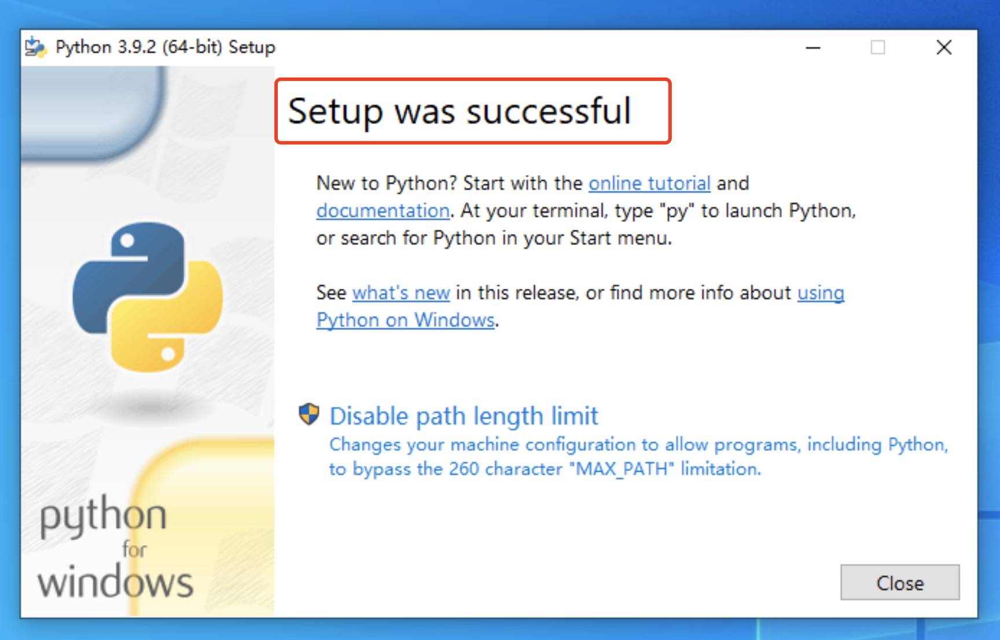

# Windows 安装Python环境

Windows环境安装Python特别简单，只需要下载好安装包后，下一步、下一步的即可完成安装。

1. 用浏览器打开Python官网，选择下载，选择Windows对应的版本。

   

   

2. 下载成功后，进入至下载目录，双击打开Python3.x文件；

    

3. 双击打开文件弹出的安装窗口，请注意：

   在下面将Add Python 3.9 to PAT打钩后，

   通常单机红框 里面的“ Install Now”。

4. 出现下图的界面，即为安装成功。

5. 验证是否安装成功。点击左下脚的win图标，然后输入`cmd`  ，打开命令行。

6. 打开命令行后输入：

   ~~~
   python -V
   pip  -V
   ~~~

   显示下图界面，即为Python 环境安装成功。

