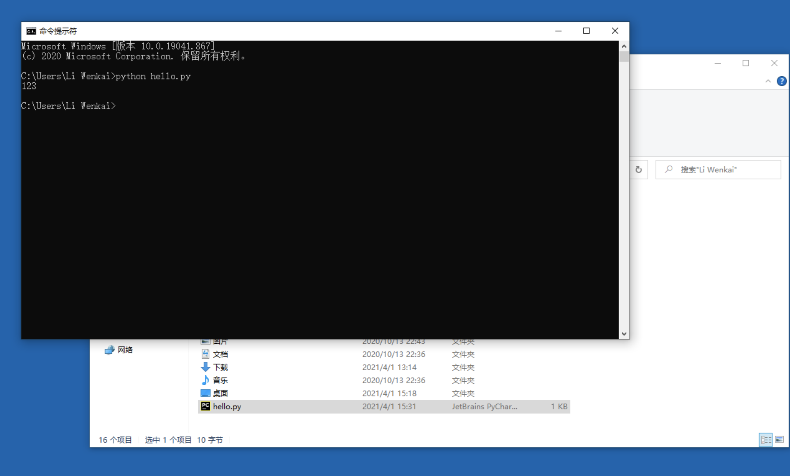

#  基本语法要牢记

## 基本语法

基本语法就是组成编程语言的基本规则，是一些非常具体的规定。

对于编程语言当中的基本语法：我们认为跟地球的法则一样，在没有办法打破法则之前就是规定，规则。

> 切记不要犯很多新手一样的毛病——为什么这个基本语法要这样写呢？

#### 基本语法注意事宜

李老师曾经带过很多新手，也看过很多人写代码。其中的有些人，在写代码的时候：

> ——觉得自己是天才，一看就懂。

而实际过程当中，往往是：

> 一看就懂，一写就错。

所以我们给所有刚入门学习编程（任何语言）的朋友一个总结了我十年的经验：

> 永远不要骗自己，写不出来代码就是不会。

李文凯老师语录：基本语法的训练要像亲吻一样熟练。

# 两种运行代码的方式（二选一）

> 如果你对开发环境和运行代码比较熟悉，可跳过下面部份。
>
> 提示：阅读下面部分时，请提前安装好Python环境和PyCharm 开发工具。

在后面的代码过程当中，我们会把代码为大家准备好，大家只需要看着文档理解意思。同时，将相关代码粘贴至开发运行环境学习、调试、理解即可。

粘贴对应的代码至你的开发工具（如:PyCharm）中, Run 运行代码即可。(参考：[开发工具](tool.md)  **新建配置PyCharm项目** 这一部份 )

运行代码一般有三种方式：

1. 基于开发工具（也叫IDEA），如PyCharm中点击Run 运行代码；【重点】
2. 也可以将代码写好后，在命令行中运行；【重点】
3. 简单代码，不需长期保存的代码，还可以在命令行中启动Python运行。（暂时不用学习）

## 在PyCharm中运行

1. 在项目录上，鼠标右键点击new(新建文件)   -> Python File ，弹出窗口后写上文件名：demo，然后按回车键。

写上文件名：demo

文件名会自动补全，并会自动打开这个文件：

在文件中写入代码：

~~~python
print(123)
~~~

调整配置，修改为demo.py：

将Script path里的main.py内容改为demo.py，然后点击Apply或者ok：

运行显示成功，**恭喜你代码运行配置成功！**

## 在命令行运行

很多时候，在服务器上并没有安装开发工具。但是，我们也需要运行代码。那应该怎么运行呢？

进入到我们所写的Python文件对应的目录。格式如下：

> python 文件名
>
> 或者
>
> python3.x 文件名

在Windows平台下和Linux平台下我们分别举例，在Windows平台下，我们打开命令行。

操作步骤：开始菜单  -> 输入"cmd" -> 按回车键

弹出命令行（大家注意观察红框中的内容） ：

我们进入到 C:\Users\Li Wenkai 目录下：

> 如果在其他目录，大家可以使用   cd 目录名，进入至其他目录。
>
> d:    进入d盘
>
> cd    d:\code     可进入至d盘下的code目录

我们在这个目录新建一个文件： hello.py，双击打开文件，然后在hello.py里面写入：

~~~python
print(123)
~~~

注意：

hello.py 和hello.py.txt 不是同一个文件，记得将扩展名打开。设置如下：

输入 python hello.py 按回车，即可运行代码：

### linux 运行代码（可不学）

使用 vi 命令新建hello.py 文件，按i 键进入输入，写入print(123)，按ESC键，写入:wq退出：

然后在命令行输入： python hello.py ，接着按 回车，运行代码，结果如下表示运行成功：

