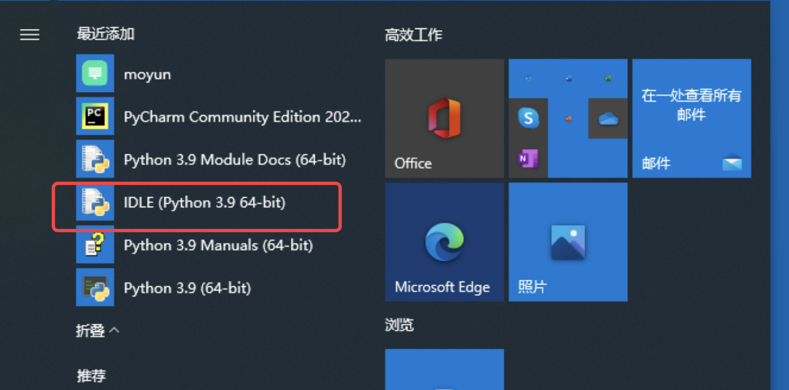
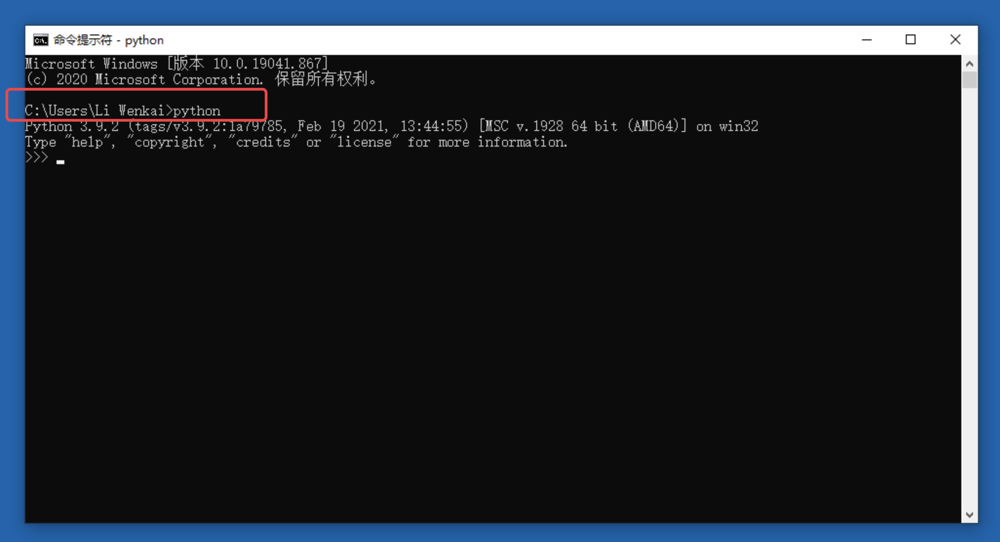
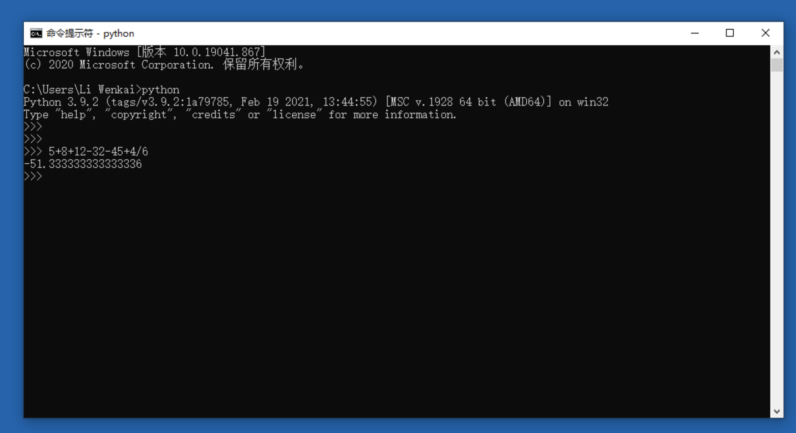
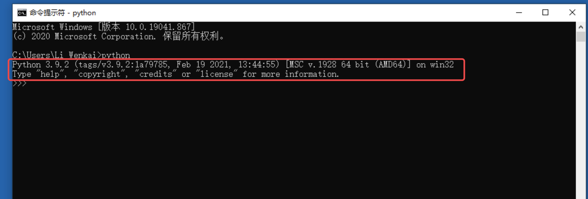
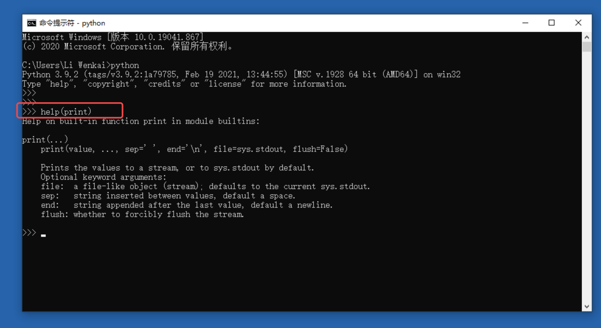
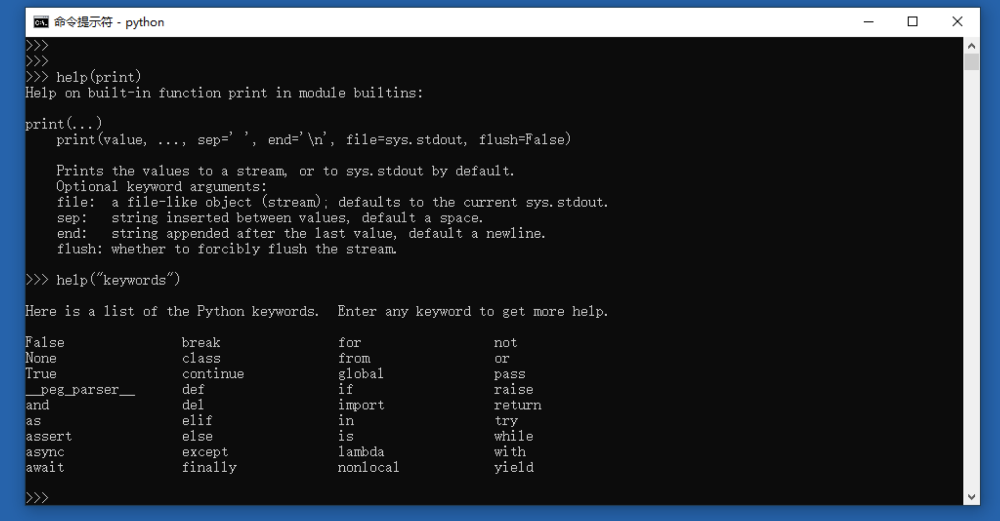

# 交互模式用来做计算器

## 当成计算器使用python交互终端

在日常计算中，经常要算很长的东西，敲计算器又太麻烦，动不动就按错。

而Python的交互模式有很多种实用的用法，最常见的就是用来作为：**计算器**使用。

1. 在开始菜单中输入cmd（参考[windows环境安装第5步](windows.md)）（图二），打开终端或者 找到IDEL 双击打开(图一)。
2. 开始输入计算内容进行计算（图三）；
3. 关闭窗口或者输入exit() 退出。

图一

图二

图三

## 交互模式看到版权相关信息

输入python后可以看到当前Python的版权信息，时间，版本，CPU指令集等。

## 交互模式获取帮助

> help( 要查询的内容，如print)  查询 print函数
>
> help( "keywords" ) 查询系统保留关键字

*****

注意：

help( ) 的内容比较多的时候，可以按键盘的 `上`    ↑     `下`     ↓  键调整行。

按  `空格`  键翻页

按 `q` 键退出

