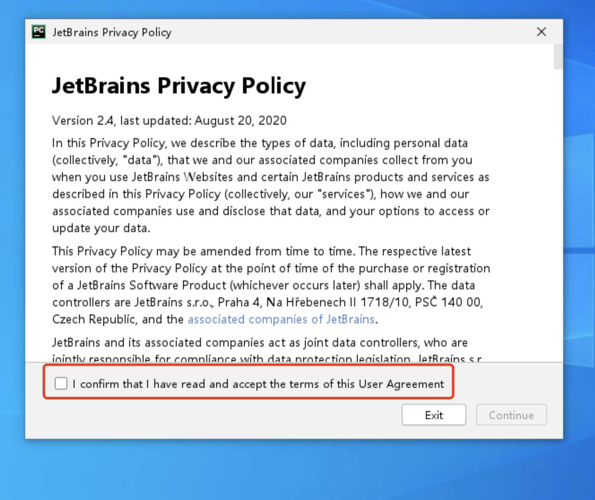

# 开发工具的选择

Python的开发工具有很多，如：

1. PyCharm
2. Vscode

很多新手特别容易在工具上左右摇摆，这个工具好，哪个工具不好，总是纠结选择哪个开发工具，结果浪费很长时间。因此不要像很多小白一样，出现前面所说的这种问题，开始就写就好，不用管哪个开发工具，迈出你的脚步，慢慢你就熟悉了。

先把代码写熟悉，写会代码才是问题的重点，工具的使用技巧是锦上添花，而你先得有“锦”才行，而写熟悉代码就是这个“锦”。

>  本文所有代码将会在PyCharm下运行调试。如果你对其他工具熟悉，请自行选择自己熟悉的工具。

## 工具下载地址

我们选择的工具是PyCharm社区版。这个版本与商业版的区别不大，PyCharm社区版是免费的，主要面向学习者和非商业用户。

https://www.jetbrains.com/pycharm/download/ （官网）

http://www.liwenkai.cn/pycharm%e4%b8%8b%e8%bd%bd  (李文凯老师加速下载站)

## windows 安装 PyCharm

下载安装包，双击打开，下一步，即完成安装（见配图）。

​										

## 启动PyChrm

双击打开桌面上的PyCharm

在方框里打钩，同意协议（第一次启动时存在）

启动成功

## 新建配置PyCharm项目

> 提示：
>
> Windows用户 ：别在C盘、桌面等区域进行下面的操作。可以在D盘、E盘等磁盘新建项目目录。因为，如果重装系统时C盘有相关文件可能造成重要代码丢失。
>
> Mac用户：此处配置建议在Document目录下进行新建目录。因为，Document目录会传送至iCloud，出现重大意外情况时，可从iCloud恢复文件。
>
> 如果你在敏感部门或涉密部门工作，请遵守保密手册和相关办法操作。

请按照上面的“提示”，自行设置项目目录。

关闭启动时PyCharm技巧提示：

等待虚拟环境配置成功：

新建项目文件夹成功：

改一下代码试试：

运行成功：

## 恭喜你，配置成功！

