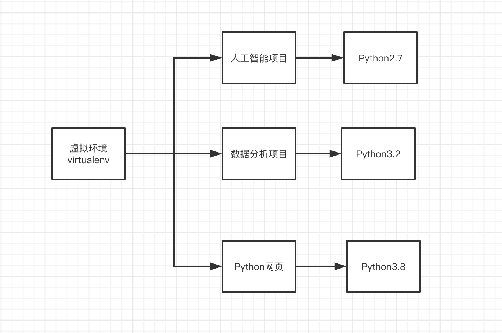

# Python虚拟环境——virtualenv


在Python开发中，Python的各种库跨度比较大，比如如果你开发网页，一个项目使用Django版本为1.8， 而另一个项目使用Django版本是1.7， 这就给开发人员带来很多麻烦。

而virtualenv就是解决这种情况的，virtualenv通过创建一个虚拟化的Python运行环境，将我们所需的依赖安装进去，不同项目之间相互不干扰。



上面的这种情况在其他语言里面特别不好解决，而在Python里面就比较好解决。


## 1. 安装

安装虚拟环境特别简单，我们之前学过pip 包管理，直接使用就好。

~~~
pip install virtualenv
~~~


## 2. 测试安装

~~~
virtualenv --version
~~~


## 3. 为项目创建虚拟环境

1. 进入指定的目录
2. virtualenv 自定义名称。


```
cd project
virtualenv your_project_name
```

 另外，如果存在多个Python解释器，可以选择指定一个Python解释器（比如``python2.7``），没有指定则由系统默认的解释器来搭建： 

~~~
virtualenv -p python2.7 项目名
~~~


## 4. 激活虚拟环境

~~~
source 虚拟项目名  activate
~~~

这样您就进入到了自己创建的虚拟环境中了。


## 5. 退出虚拟环境

```
deactivate
```


# virtualenvwrapper

提供了一系列命令使得和虚拟环境工作变得愉快许多。它把您所有的虚拟环境都放在一个地方。

1. 将您的所有虚拟环境放在一个地方。
2. 包装用于管理虚拟环境（创建，删除，复制）。
3. 使用一个命令来对环境之间进行切换。

###   1、安装

  安装（确保 **virtualenv** 已经安装了）：

```
pip install virtualenvwrapper
export WORKON_HOME=~/Envs  #设置环境变量
mkdir -p $WORKON_HOME #创建虚拟环境管理目录
find / -name virtualenvwrapper.sh #找到virtualenvwrapper.sh的路径
source 路径 #激活virtualenvwrapper.sh
```

  默认virtualenvwrapper安装在下面Python解释器中的site-packages，实际上需要运行virtualenvwrapper.sh文件才行；所以需要先进行配置一下：

- `找到virtualenvwrapper.sh的路径：find / -name virtualenvwrapper.sh `
- 运行virtualenvwrapper.sh文件：source 路径

**ps：每次要想使用virtualenvwrapper 工具时，都必须先激活virtualenvwrapper.sh,另外，如果创建前要将即将的环境保存到Envs中，就要先设置一下环境变量：**export WORKON_HOME=~/Envs，再搭建

 

对于Windows，您可以使用 virtualenvwrapper-win

  安装（确保 **virtualenv** 已经安装了）：

```
pip install virtualenvwrapper-win
在Windows中，WORKON_HOME默认的路径是 %USERPROFILE%Envs 。
```

### 2、基本使用

1、创建一个虚拟环境：

```
mkvirtualenv project_env
```

`  这会在Envs` 中创建 project_env虚拟环境

　  选择一个Python解释器来搭建：

```
mkvirtualenv env  --python=python2.7
```

 

2、在虚拟环境上工作：

```
 workon project_env
```

或者，您可以创建一个项目，它会创建虚拟环境，并在 `$WORKON_HOME` 中创建一个项目目录。 当您使用 `workon `project_env 时，会 `cd` -ed 到项目目录中。

```
mkvirtualenv project_env
```

**virtualenvwrapper** 提供环境名字的tab补全功能。当您有很多环境， 并且很难记住它们的名字时，这就显得很有用。

`workon` 也能停止您当前所在的环境，所以您可以在环境之间快速的切换。

3、停止虚拟环境

```
deactivate
```

4、删除：

```
 rmvirtualenv project_env
```

5、其他常用命令

~~~
lsvirtualenv    	#列举所有的环境。

cdvirtualenv    	#导航到当前激活的虚拟环境的目录中，比如说这样您就能够浏览它的 site-packages。

cdsitepackages   	# 和上面的类似，但是是直接进入到 site-packages 目录中。

lssitepackages     #显示 site-packages 目录中的内容。
~~~


