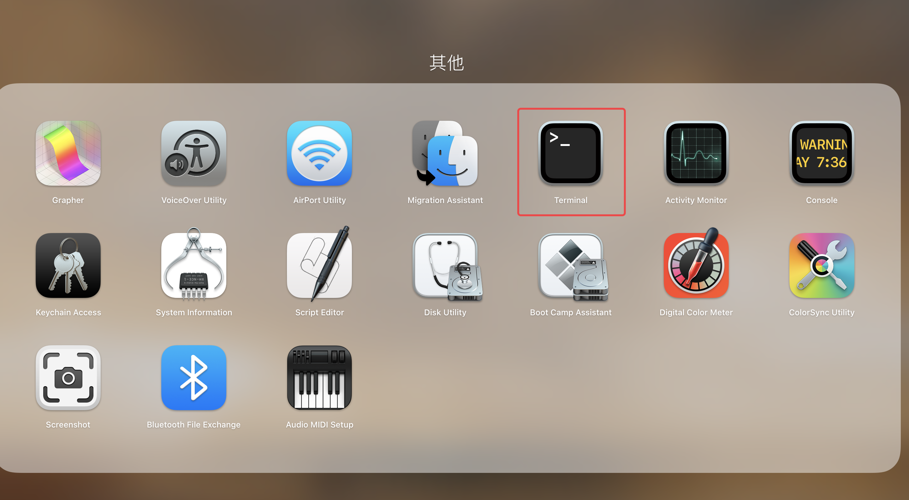
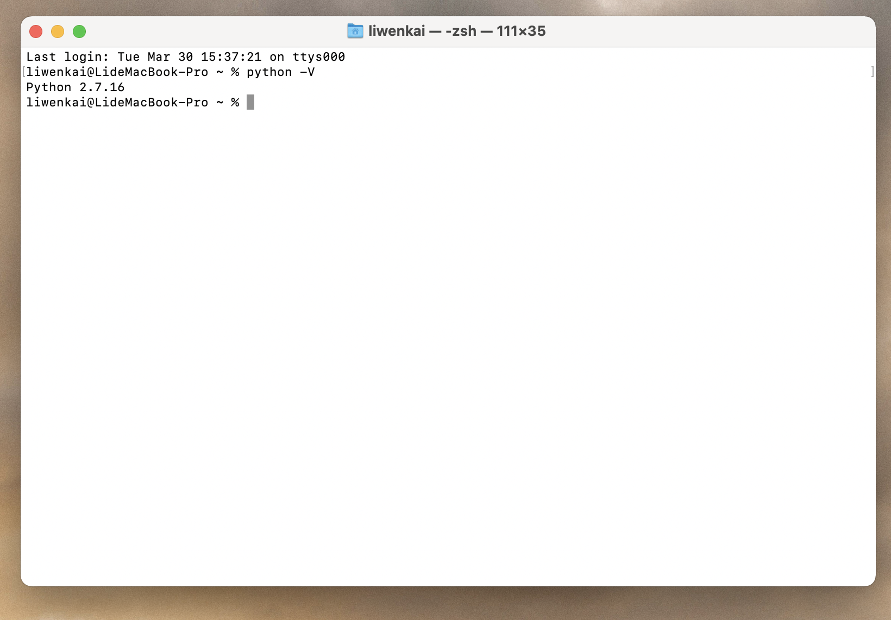
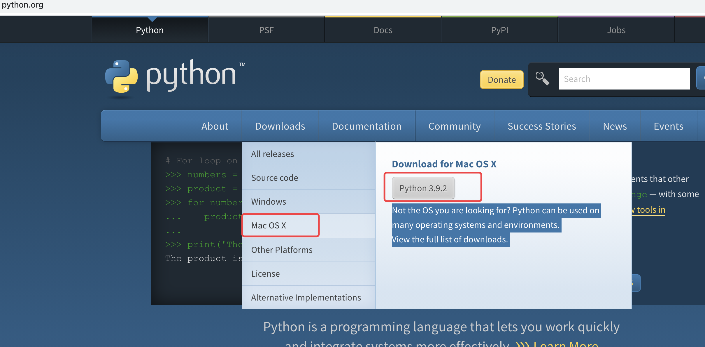
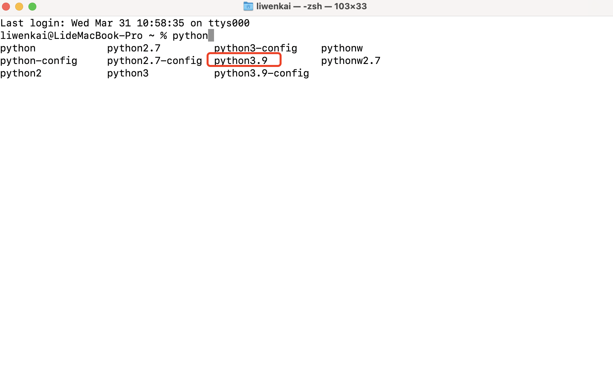
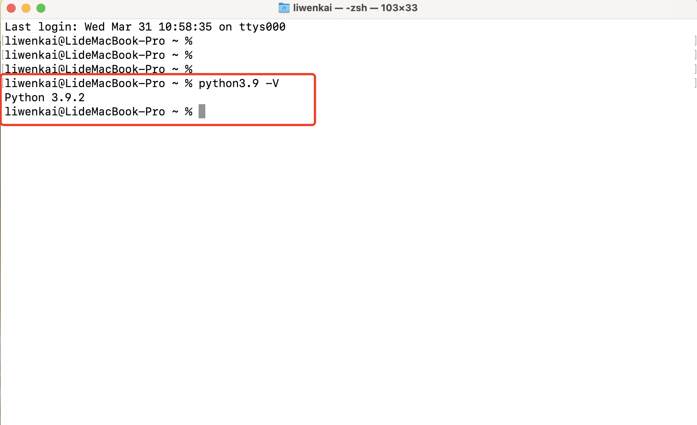

# 苹果系统安装

## 查看当前Python版本

苹果系统为MacOS系列的系统。苹果系统一般默认安装了Python2.x。

在苹果系统下打开：“DashBoard”，然后选择“其他”，打开“终端”。

在终端中输入命令：

~~~
python -V
~~~

终 端中显示的：2.7.16 就是当前Python的版本。

## 安装 Python3

1. 进入Python官网 : http://www.python.org
2. 点击Downloads  ->  Mac OS X  -> Python3.x 
3. 下载Python-3.x.pkg 成功后，进入目录，双击安装；
4. 一直单击下一步，安装成功。

## 验证Python3.x安装

1. 再次打开终端；
2. 输入python；
3. 按两次tab 键，就可以看到所有的Python列表；
4. 如果出现Python3.x 版本，即为安装成功；
5. 输入python3.9 -V，就可以显示当前的版本号和相关信息，如下图。

